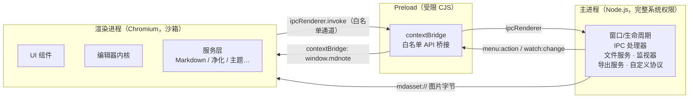
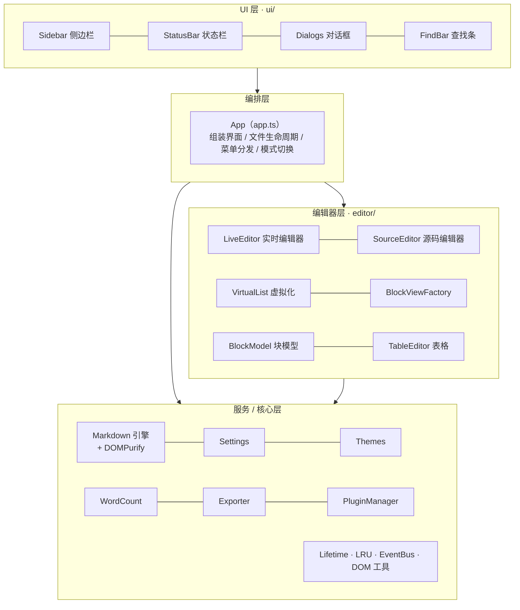
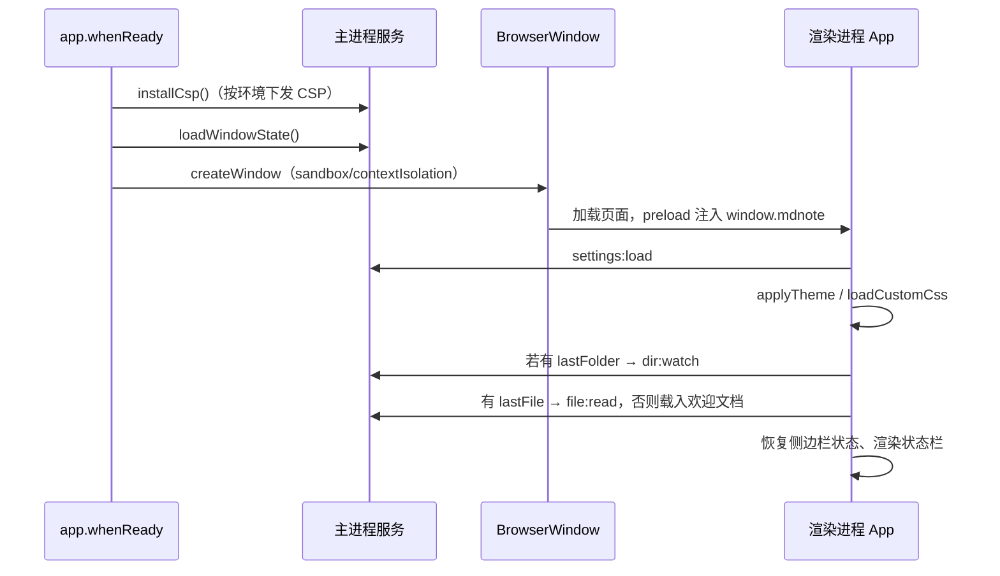
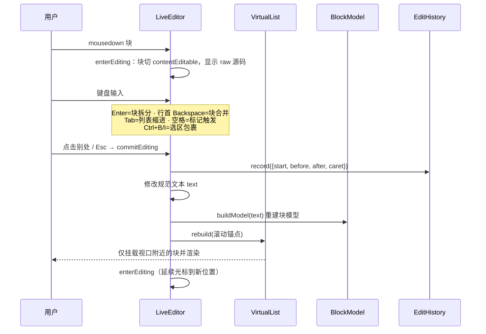
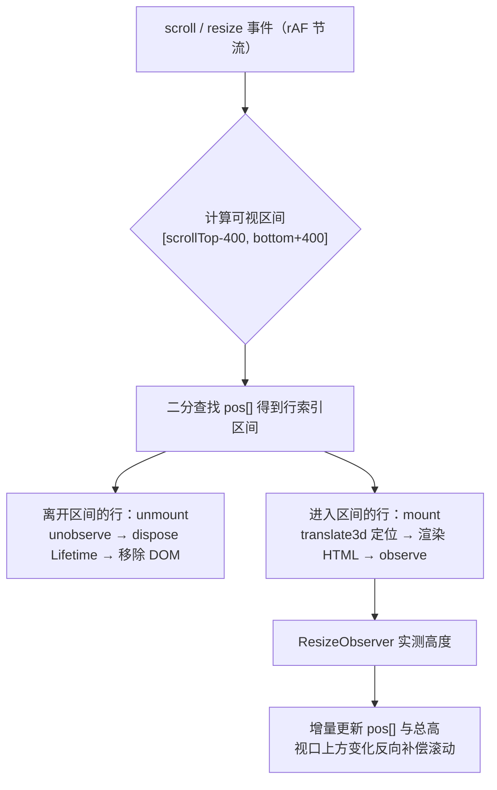

# 架构设计

本文描述 MdNote 的整体架构：进程模型、分层结构、模块职责、IPC 契约与关键运行流程。

## 1. 设计目标

| 目标 | 架构决策 |
| --- | --- |
| 可用性 | 实时渲染 + 单块源码编辑；快捷键、模式切换、会话恢复 |
| 性能 / 长文档低负载 | 块级文档模型 + 视口虚拟化；重型库动态加载；LRU 缓存 |
| 可扩展性 | markdown-it 插件机制 + 外部插件沙箱加载；渲染器/控制器分层 |
| 安全性 | 最小权限三进程模型；所有进入 DOM 的内容强制净化；协议白名单 |
| 无内存泄漏 | 统一 `Lifetime` 生命周期；事件走 AbortSignal；卸载即释放 |

## 2. 进程模型

MdNote 由 Electron 的三类执行环境组成，彼此隔离，通过**显式契约**通信：



### 各环境权限

| 环境 | Node 能力 | 可访问资源 | 安全配置 |
| --- | --- | --- | --- |
| **主进程** (`src/main`) | 完整 | 文件系统、子进程、窗口 | 只运行我方代码，不加载第三方 |
| **Preload** (`src/preload`) | 受限（沙箱 polyfill：仅 `electron`、部分 Node 模块） | 按通道转发 IPC | 无业务逻辑，只做桥接 |
| **渲染进程** (`src/renderer`) | **无** | DOM、`window.mdnote` | `sandbox + contextIsolation + nodeIntegration:false` |

## 3. 分层架构

渲染进程内部分为四层，依赖方向自上而下，**不存在反向依赖**：



- **核心层（core/）**：与业务无关的基础设施。`Lifetime`（资源生命周期）、`LRU`（定容缓存）、`EventBus`（类型安全事件）、DOM 工具函数
- **服务层（services/）**：Markdown 引擎与净化、设置、主题、字数统计、导出、插件管理
- **编辑器层（editor/）**：文档块模型、虚拟化列表、实时 / 源码编辑器、表格控制器、编辑变换、历史记录
- **编排层（app.ts）**：唯一持有全局状态（当前文件、模式、dirty）的协调者
- **UI 层（ui/）**：纯展示组件，通过回调与 App 通信，不直接操作编辑器内核

## 4. 目录结构与模块职责

```
src/
├── shared/
│   └── types.ts               # 跨进程共享类型、DEFAULT_SETTINGS、IPC 契约（MdNoteAPI）
├── main/                      # 主进程
│   ├── index.ts               # 应用/窗口生命周期、CSP 下发、导航与弹窗拦截、单实例
│   ├── ipc.ts                 # 全部 IPC 处理器集中注册
│   ├── fs-service.ts          # 文本读写、目录列举、图片导入（拷贝/落盘）
│   ├── watcher-manager.ts     # 文件夹递归监视器（事件合并，单句柄）
│   ├── asset-protocol.ts      # mdasset:// 自定义协议（图片白名单）
│   ├── export-service.ts      # PDF/图片离屏窗口导出、Pandoc 子进程
│   ├── window-state.ts        # 窗口位置/尺寸/最大化持久化
│   └── menu.ts                # 应用菜单与快捷键
├── preload/
│   └── index.ts               # contextBridge 暴露白名单 API（window.mdnote）
└── renderer/
    ├── index.html             # 渲染页面骨架
    ├── welcome.md             # 首次启动欢迎文档
    └── src/
        ├── main.ts            # 渲染入口：样式导入、App 启动
        ├── app.ts             # 编排层
        ├── global.d.ts        # window.mdnote 全局类型
        ├── core/              # Lifetime / LRU / EventBus / DOM 工具
        ├── services/          # markdown / settings / themes / word-count / exporter / plugins
        ├── editor/            # 文档模型与两种编辑器、虚拟化、表格、变换、历史
        ├── ui/                # sidebar / statusbar / dialogs / findbar
        └── styles/            # 4 套主题变量 + 布局 + 排版 + 组件样式
```

## 5. IPC 契约

所有跨进程通信都在 `src/shared/types.ts` 的 `MdNoteAPI` 中声明，
由 preload 实现、主进程 `ipc.ts` 处理。通道面保持最小：

### 渲染进程 → 主进程（invoke/on）

| 通道 | 方向 | 用途 |
| --- | --- | --- |
| `file:read` / `file:write` | invoke | 读写文本文件（读取有 50MB 上限） |
| `dialog:open` / `dialog:save` / `dialog:folder` | invoke | 原生打开 / 保存 / 文件夹对话框 |
| `dir:list` | invoke | 惰性列举单层目录 |
| `dir:watch` / `dir:unwatch` | invoke | 建立 / 关闭文件夹监视器 |
| `settings:load` / `settings:save` | invoke | 设置读写 |
| `image:import` / `image:save-buffer` | invoke | 图片拷贝 / 缓冲区落盘，返回嵌入路径 |
| `shell:open-path` / `shell:show-item` / `shell:open-external` | invoke/on | 系统打开、资源管理器定位、外链浏览器（scheme 白名单） |
| `export:html` / `export:pdf` / `export:image` | invoke | 三类内置导出 |
| `pandoc:available` / `pandoc:export` | invoke | Pandoc 检测与调用 |
| `custom-css:load` / `custom-css:open` | invoke | 自定义 CSS 读取 / 用系统编辑器打开 |
| `plugins:list` / `plugins:source` | invoke | 插件清单 / 读取插件源码（限插件目录内） |
| `find:in-page` / `find:stop` | on | 页面内查找 |
| `context-menu` | invoke | 原生右键菜单，返回所选 id |
| `path:user-data` | sendSync | 获取用户数据目录（仅启动期） |

### 主进程 → 渲染进程

| 通道 | 用途 |
| --- | --- |
| `menu:action` | 菜单 / 快捷键动作（`MenuAction` 枚举见 types.ts） |
| `watch:change` | 文件夹变更事件（已做合并去重） |

> 所有渲染进程提交的参数均为普通可序列化数据，主进程在调用服务前做路径规范化与
> 白名单校验；渲染进程永远拿不到文件系统句柄。

## 6. 关键运行流程

### 6.1 启动流程



### 6.2 实时编辑流程（点击 → 编辑 → 提交）



### 6.3 虚拟化挂载流程



## 7. 核心抽象

### 7.1 Lifetime（资源生命周期）

所有需要清理的东西（事件监听、Observer、定时器、订阅）都登记到 `Lifetime`：

- `lt.on(target, type, handler)` —— 内部用 `AbortController` 的 signal 注册，`dispose()` 时一次性全部移除
- `lt.interval() / lt.timeout()` —— 定时器自动清理
- `lt.add(disposeFn)` —— 任意自定义释放逻辑
- `dispose()` 逆序执行、幂等（只执行一次）；组件树中每层持有自己的 Lifetime，父层释放时子层先释放

这是防内存泄漏的主干机制：**块卸载 → 行级 Lifetime dispose → 监听/Observer/控制器全部失效**。

### 7.2 LRU（定容缓存）

Map 实现的 O(1) LRU，触达即刷新顺序，超容量淘汰最旧项并回调释放。
用于块渲染 HTML 缓存（容量 300）与实测高度缓存（限量 2000 清理）。

### 7.3 EventBus

微型类型安全事件总线，订阅可绑定 Lifetime 自动退订；监听器执行互相隔离异常。

## 8. 状态归属

| 状态 | 持有者 | 持久化 |
| --- | --- | --- |
| 规范 Markdown 文本 | LiveEditor（实时）/ SourceEditor（源码） | 保存时写文件 |
| 文档块模型 | LiveEditor（每次文本变更重建） | 不持久化（派生数据） |
| 当前文件路径 / 模式 / dirty | App | lastFile 入设置 |
| 用户设置 | SettingsService（单例） | userData/settings.json |
| 窗口位置尺寸 | window-state 模块 | userData/window-state.json |
| 编辑历史 | EditHistory（内存，容量 300） | 不持久化 |

**关键原则**：规范文本是唯一事实源，块模型、大纲、字数统计、TOC 全部是它的**派生数据**，
任何时候都可以丢弃重建，不存在「第二份需要同步的文档」。

## 9. 相关文档

- [数据模型](data-model.md)：块切分规则与偏移不变量
- [性能设计](performance.md)：虚拟化与缓存细节、基准数据
- [安全模型](security.md)：隔离、净化与 CSP
- [插件开发](plugin-development.md)：扩展点与 API
- [开发指南](development.md)：调试、测试与规范
