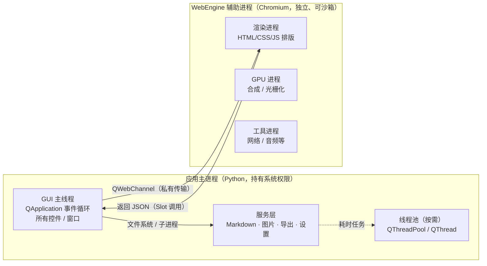
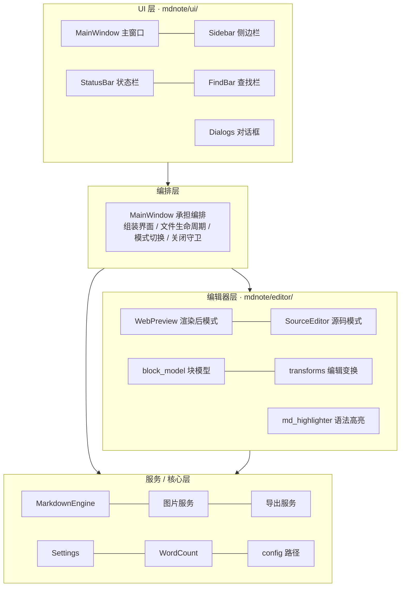
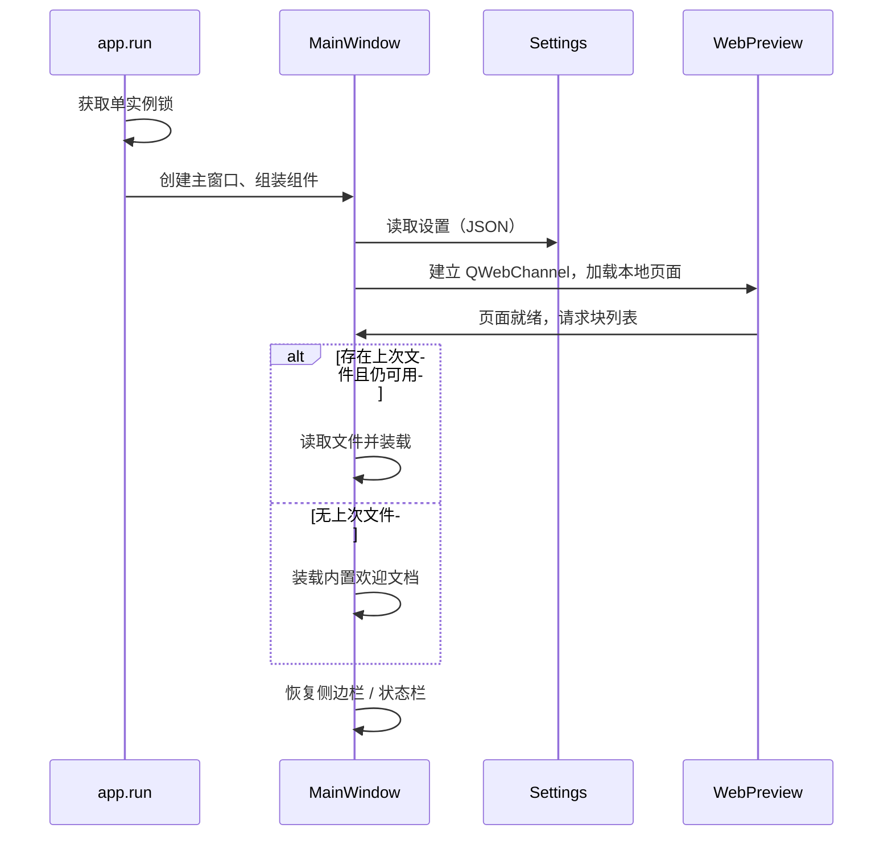
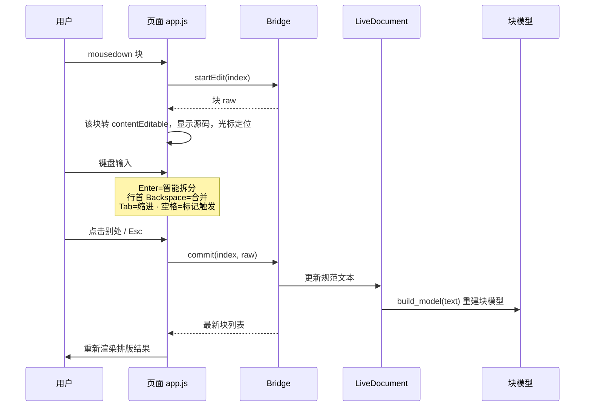

# 架构设计

本文描述 MdNote 的整体架构：进程 / 线程模型、分层结构、模块职责、
Python 与页面之间的 QWebChannel 契约，以及关键运行流程。

## 1. 设计目标

| 目标 | 架构决策 |
| --- | --- |
| 流畅的编辑体验 | 渲染后编辑 + 源码编辑双模式；快捷键、智能回车、会话恢复 |
| 原生性能 | PySide6 原生控件；排版交给隔离的 WebEngine 进程 |
| 可扩展性 | 基于 Python-Markdown 的扩展机制；渲染器与控制器分层 |
| 安全性 | 最小权限桥接；进入页面的内容强制处理；导航与外部协议受控 |
| 可维护性 | 分层清晰；规范文本作为唯一事实源，其余均为可重建派生物 |

## 2. 进程与线程模型

应用以 Python 解释器启动，进程空间中运行 Qt 事件循环；
Qt WebEngine 另外派生若干基于 Chromium 的辅助进程，彼此隔离：



### 各部分职责与边界

| 部分 | 运行位置 | 能力 | 边界 |
| --- | --- | --- | --- |
| **GUI 主线程** | 应用进程 | 全部控件、文件 / 子进程调用 | 只运行我方代码；不在此执行第三方页面脚本 |
| **服务层** | 应用进程（可移入线程池） | Markdown 渲染、图片落盘、导出、设置持久化 | 不直接持有 UI 引用 |
| **WebEngine 渲染进程** | 独立进程 | 页面 DOM、排版、页面 JS | 无 Python 能力；只能经 QWebChannel 访问白名单方法 |
| **GPU / 工具进程** | 独立进程 | 合成、网络等 | 由 WebEngine 管理，应用不直接通信 |

### 单实例守护

应用通过本地命名套接字保证只运行一个实例（`mdnote/app.py`）：
启动时尝试连接固定名称的本地服务器，若已存在则直接退出；
否则创建服务器并继续。再次启动安装程序或可执行文件时不会产生第二个窗口。

## 3. 分层架构

应用进程内部分为四层，依赖方向自上而下，不存在反向依赖：



- **核心层（`core/`）**：设置服务、字数统计等基础设施
- **服务层（`services/`）**：Markdown 引擎、图片落盘、导出
- **编辑器层（`editor/`）**：块模型、编辑变换、两种编辑器及 Web 资源
- **编排层**：`MainWindow` 是唯一持有全局状态（当前文件、模式、dirty）的协调者
- **UI 层（`ui/`）**：展示组件，通过信号 / 方法与编排层通信

## 4. 目录结构与模块职责

```
mdnote/
├── app.py                 # QApplication、单实例守护、启动入口
├── config.py              # 用户数据目录、Web 资源路径（兼容打包环境）
├── __main__.py            # 支持 python -m mdnote
├── core/
│   ├── settings.py        # AppSettings 数据类、JSON 持久化、变更通知
│   └── word_count.py      # 中英文混排字数 / 字符 / 行数 / 阅读时长
├── editor/
│   ├── block_model.py     # 块模型：解析 / 序列化 / 偏移 / 标题提取
│   ├── transforms.py      # 纯函数：回车拆分 / 合并 / 缩进 / 空格触发
│   ├── source_editor.py   # QPlainTextEdit：行号区、自动括号、Tab 缩进
│   ├── md_highlighter.py  # QSyntaxHighlighter：Markdown 规则高亮
│   ├── webview.py         # WebPreview + QWebChannel Bridge + LiveDocument
│   └── web/               # 排版页面
│       ├── index.html     # 页面骨架（加载离线 KaTeX / Mermaid）
│       ├── styles.css     # 排版样式、明暗主题、专注模式
│       ├── app.js         # 前端控制器：块渲染 / 点击编辑 / 按键
│       └── vendor/        # 离线内置的 KaTeX、Mermaid
├── services/
│   ├── markdown_engine.py # Python-Markdown 封装：Pygments、任务列表、nl2br
│   ├── plugin_loader.py   # 用户插件发现与加载
│   ├── search_service.py  # 文件夹检索（后台 QThread）
│   ├── image_service.py   # 图片拷贝 / base64 落盘，返回嵌入引用
│   └── exporter.py        # HTML / PDF / 图片导出、Pandoc 调用
└── ui/
    ├── main_window.py     # 多标签管理、菜单、全局焦点导航
    ├── editor_session.py  # 单个标签的会话：文档+两种编辑器+模式/文件/dirty
    ├── sidebar.py         # 文件树 + 大纲（Esc 返回编辑器）
    ├── statusbar.py       # 状态栏
    ├── findbar.py         # 查找 / 替换
    └── dialogs.py         # 原生对话框、命令面板、设置面板

launch.py                  # 打包入口（绝对导入）
scripts/make_icon.py       # 应用图标生成
tests/
├── test_editor.py         # 编辑器变换纯函数回归
├── test_plugin_loader.py  # 插件加载器测试
└── test_live_editor.py    # WebEngine 集成测试
installer/setup.nsi        # NSIS 安装程序脚本（支持自定义安装路径）
```

### 4.1 标签与会话

主窗口用一个可关闭、可拖动的 `QTabWidget` 承载多个 :class:`EditorSession`：

- 每个 **会话**独立持有自己的 `LiveDocument`、`WebPreview`、`SourceEditor`、
  文件路径、模式与 dirty 状态，以及仅作用于本会话的防抖计时器
- 全局的侧边栏、查找栏、状态栏、文件监视器由主窗口持有，菜单动作统一**委托给当前标签**
- 打开文件时若该路径已在某标签中打开，则聚焦该标签而不是重复打开
- 切换标签时：状态栏 / 标题刷新为该会话状态，文件监视器重新对准该标签的文件
- 关闭标签或退出时，对未保存的会话执行 保存 / 不保存 / 取消 守卫

主窗口同时保留少量委托属性（`_doc/_preview/_source/...`）指向当前会话。

## 5. Python ↔ 页面 桥接契约

实时模式下，页面 JavaScript 不直接接触系统能力，所有操作都通过
QWebChannel 暴露的一个 `Bridge` 对象（`mdnote/editor/webview.py`）进行。
参数与返回值统一使用 JSON 字符串，保持两端解耦。

### 页面 → Python（在 Bridge 上以 Slot 暴露）

| 方法 | 参数 | 返回 | 用途 |
| --- | --- | --- | --- |
| `loadBlocks` | — | 块列表 JSON | 读取全部块（含类型、raw、渲染 HTML） |
| `startEdit` | 块索引 | 字符串 | 获取该块原始 Markdown |
| `commit` | 块索引、raw | 块列表 JSON | 提交块编辑并返回最新块列表 |
| `commitAndLocate` | 块索引、raw、目标块索引 | 块列表 + 目标索引 | 提交当前块并定位到另一块（跨块跳转） |
| `updateDraft` | 块索引、raw | — | 编辑期间持续同步输入，保持块索引稳定 |
| `transform` | 块索引、命令、偏移、当前 raw | 变换结果 JSON | 执行回车 / 合并 / 缩进 / 空格触发 |
| `toggleTask` | 块索引 | 块列表 JSON | 切换任务列表复选状态 |
| `addImage` | 参数 JSON | 字符串 | 图片 base64 落盘，返回 `` 引用 |
| `updateTable` | 块索引、表格 Markdown | 块列表 JSON | 表格单元格编辑回写 |
| `openExternal` | URL | — | 以白名单协议（http/https/mailto）交系统程序打开 |
| `undo` / `redo` | — | 块列表 JSON | 撤销 / 重做 |

`transform` 的命令取值：`enter`、`backspace`、`tab`、`shiftTab`、`spaceProbe`。

> **偏移编码**：页面 DOM 选区以 UTF-16 码元计数，而 Python 字符串以码点计数。
> `Bridge.transform` 在两端之间做换算（UTF-16 ↔ 码点），保证含中文 / Emoji 时光标偏移仍准确。

### Python → 页面

两种方式：

- **信号**：`Bridge` 上定义的 `Signal` 可携带数据推送到页面
- **`page().runJavaScript(...)`**：直接执行页面脚本（如应用外观偏好、滚动定位）

> 页面始终拿不到文件句柄、子进程句柄或任意路径访问能力，
> 只能表达「请对当前文档执行这件白名单内的操作」。

## 6. 关键运行流程

### 6.1 启动与会话恢复



### 6.2 实时编辑流程（点击 → 编辑 → 提交）



### 6.3 模式切换

- 渲染后 → 源码：取当前规范文本写入 `SourceEditor`，切换堆叠页面，聚焦编辑器
- 源码 → 渲染后：把编辑器文本写回 `LiveDocument`，重建块模型并渲染
- 切换时不丢失内容；切换后大纲、字数均以当前文本重新计算

### 6.4 关闭守卫

点击窗口关闭按钮或按 `Ctrl+Q` 时：

1. 若无未保存修改，直接关闭
2. 若有修改，弹出原生对话框：**保存 / 不保存 / 取消**
   - 保存：写入文件（若需另存为被取消，则不退出）后关闭
   - 不保存：直接关闭
   - 取消：窗口保留

### 6.5 命令面板

按 `Ctrl+Shift+P` 打开 `CommandPalette`（`ui/dialogs.py`）：

- 命令来源是菜单栏的全部动作（`menu_commands()` 递归遍历菜单树）
- 搜索框按空格分词、大小写不敏感地过滤；列表项同时显示快捷键
- `↑↓` 选择、`Enter` 执行、`Esc` 取消；已禁用的动作不会出现

这样即使不记得菜单层级或快捷键，所有功能仍然可搜索到达。

### 6.6 焦点导航（全键盘操作）

界面划分为三个可聚焦区域：**编辑器、侧边栏、查找栏**：

| 操作 | 行为 |
| --- | --- |
| `F6` / `Shift+F6` | 在编辑器 → 侧边栏 → 查找栏之间正向 / 逆向循环焦点 |
| `Ctrl+Shift+E` / `Ctrl+Shift+L` | 直接展开侧边栏并聚焦文件树 / 大纲 |
| `Ctrl+Alt+E` | 返回编辑器焦点 |
| 侧边栏内 `Esc` | 返回编辑器（`return_editor_requested`） |
| 文件树 `Enter` / 大纲 `Enter` | 打开文件 / 跳转章节 |

侧边栏在切换前后保持当前标签页与选中行；关闭侧边栏时焦点自动回到编辑器。

## 7. 状态归属

| 状态 | 持有者 | 持久化 |
| --- | --- | --- |
| 规范 Markdown 文本 | `LiveDocument`（实时）/ `SourceEditor`（源码） | 保存时写入文件 |
| 文档块模型 | `LiveDocument`（文本变更时重建） | 不持久化（派生数据） |
| 当前文件路径 / 模式 / dirty | `MainWindow` | lastFile 写入设置 |
| 用户设置 | `SettingsService` | 用户数据目录 `settings.json` |
| 撤销 / 重做 | `LiveDocument`（快照栈） | 不持久化 |

**关键原则**：规范文本是唯一事实源；块模型、大纲、字数、目录都是它的派生数据，
任何时候都可以丢弃重建，不存在需要额外同步的第二份文档。

## 8. 相关文档

- [数据模型](data-model.md)：块切分规则与偏移不变量
- [性能设计](performance.md)：渲染、缓存与长文档优化
- [安全模型](security.md)：进程隔离、桥接边界与导航控制
- [插件开发](plugin-development.md)：Python-Markdown 扩展机制
- [开发指南](development.md)：调试、测试、构建与发版
