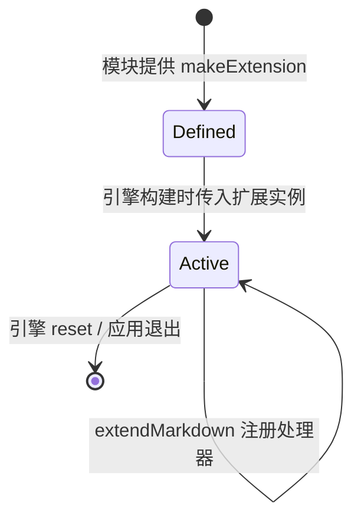

# 扩展与插件开发

MdNote 的可扩展性建立在 **Python-Markdown 扩展机制**之上：
Markdown 的解析由一系列处理器（processor）组成，你可以注册新的处理器来
增加语法、改写树结构或调整输出。本文介绍扩展点、插件结构、安装启停与完整示例。

> 插件机制当前已可用：把扩展放入用户数据目录的 `plugins/` 文件夹，
> 在 **设置 → 插件** 中勾选即启用、取消即停用；变更后即时生效，重启也会自动加载。
> 也可以直接在代码中把扩展实例传给引擎。

## 1. 扩展点总览

| 扩展点 | 能力 | 基类 / 注册位置 |
| --- | --- | --- |
| 行内处理器 | 识别行内语法并生成元素（如自定义标记、替换符） | `InlineProcessor`，`md.inlinePatterns.register` |
| 块处理器 | 识别块级结构（如自定义容器、提示块） | `BlockProcessor`，`md.parser.blockprocessors.register` |
| 树处理器 | 在生成的元素树上做整体改写 | `Treeprocessor`，`md.treeprocessors.register` |
| 预处理 / 后处理 | 在解析前调整源行 / 输出后处理 | `Preprocessor` / `Postprocessor` |

扩展产出的 HTML 与其他渲染内容一样经过 nh3 白名单净化，
因此输出标签必须是允许的排版标签（如 `span`、`div` 等）。

## 2. 安装插件

插件目录为 `<用户数据目录>/plugins/`，支持两种布局：

```
<用户数据目录>/plugins/
├── my_ext.py                 # 单文件：模块名取文件名（下划线开头的文件忽略）
└── my_pkg/
    └── __init__.py           # 或一个 Python 包
```

查看插件目录的实际路径：**设置 → 插件**下方提示，或：

```python
from mdnote.services.plugin_loader import plugins_dir
print(plugins_dir())
```

安装步骤：

1. 把提供 `makeExtension()` 的 `.py` 文件（或包）放入插件目录
2. 打开 **设置（Ctrl+,）→ 插件**，勾选该插件并确定
3. 渲染立即使用新插件；列表中找不到的已勾选插件会灰色标注「未找到」

仓库提供可直接试用的示例：[`examples/plugins/example_replace.py`](../examples/plugins/example_replace.py)
（把 `->`、`:ok:` 替换为箭头、✅），复制进插件目录即可。

> 插件是 Python 代码，运行在本应用进程中，请只启用信任来源。
> 某插件加载失败（导入错误、缺少 `makeExtension` 等）会弹出提示，且不影响其它插件。

## 3. 生命周期



- 每次渲染都会构建 / 重置 Markdown 引擎；扩展通过 `extendMarkdown(md)` 注册处理器
- 处理器是无长期状态的纯解析逻辑；不要在处理器中持有 UI 引用

## 4. 完整示例：行内替换扩展

`my_extension.py`：

```python
"""将 -> 替换为箭头、:ok: 替换为标记的扩展。"""

import xml.etree.ElementTree as etree

from markdown.extensions import Extension
from markdown.inlinepatterns import InlineProcessor


class ReplaceProcessor(InlineProcessor):
    REPLACEMENTS = {
        "->": "→",
        "<-": "←",
        ":ok:": "✅",
    }

    def handleMatch(self, match, data):
        key = match.group(1)
        if key not in self.REPLACEMENTS:
            return None, match.start(0), match.end(0)
        span = etree.Element("span")
        span.text = self.REPLACEMENTS[key]
        return span, match.start(0), match.end(0)


class ReplaceExtension(Extension):
    PATTERN = r"(:ok:|->|<-)"

    def extendMarkdown(self, md):
        # 优先级高于默认规则（数值越大越优先）
        md.inlinePatterns.register(
            ReplaceProcessor(self.PATTERN, md), "short-replace", 175
        )


def makeExtension(**kwargs):
    return ReplaceExtension(**kwargs)
```

### 在代码中直接验证

开发插件时可脱离应用、单独验证输出：

```python
import markdown

text = "状态 :ok: ，方向 ->"
html = markdown.markdown(text, extensions=["my_extension"])
print(html)
# <p>状态 <span>✅</span> ，方向 <span>→</span></p>
```

正式使用时按 §2 放入插件目录勾选即可；输出中的 `<span>` 在 nh3 允许列表内。

## 5. 完整示例：块级提示容器

为 `::: tip` … `:::` 生成一个提示块：

```python
import xml.etree.ElementTree as etree
import re

from markdown.extensions import Extension
from markdown.blockprocessors import BlockProcessor


class TipBlockProcessor(BlockProcessor):
    OPEN = re.compile(r"^::: *(\w+)?\s*$")

    def __init__(self, parser):
        super().__init__(parser)
        self._kind = "tip"

    def test(self, parent, block):
        return bool(self.OPEN.match(block.splitlines()[0]))

    def run(self, parent, blocks):
        first = blocks[0].splitlines()
        m = self.OPEN.match(first[0])
        self._kind = (m.group(1) or "tip").strip()

        lines = first[1:]
        blocks[0] = "\n".join(lines[lines.index(":::") + 1:]) if ":::" in lines else ""
        inner = "\n".join(lines[: lines.index(":::")]) if ":::" in lines else ""

        box = etree.SubElement(parent, "div", {"class": f"callout callout-{self._kind}"})
        self.parser.parseChunk(box, inner)
        if blocks[0] == "":
            blocks.pop(0)
        return True


class TipExtension(Extension):
    def extendMarkdown(self, md):
        md.parser.blockprocessors.register(
            TipBlockProcessor(md.parser), "tip-block", 175
        )


def makeExtension(**kwargs):
    return TipExtension(**kwargs)
```

配合自定义样式即可得到提示块（`div` / `class` 均在净化允许范围内）。

## 6. 安全约束

- 扩展输出与其他 Markdown 内容一样经过 **nh3 白名单净化**
- 无法输出脚本、内联事件或不在白名单内的标签 / 属性
- 扩展运行在应用主进程的渲染服务中，但应只做纯文本 / 树变换，
  不应执行网络访问、子进程或文件写入
- 不要在处理器中保存会随文档增长的全局状态

## 7. 调试

1. 先用 `markdown.markdown(text, extensions=[...])` 在脚本里单独验证扩展输出
2. 输出若被净化改变，检查所用标签 / 属性是否在 `editor/webview.py` 的允许列表内
3. 行内规则不生效时，检查 `register` 的优先级与正则分组
4. 块规则不生效时，确认 `test()` 能匹配块首行，以及 `run()` 正确消费了输入行

## 8. 相关文档

- [架构设计](architecture.md)：Markdown 服务与桥接位置
- [数据模型](data-model.md)：解析结果如何进入块模型
- [安全模型](security.md)：扩展输出的净化约束
