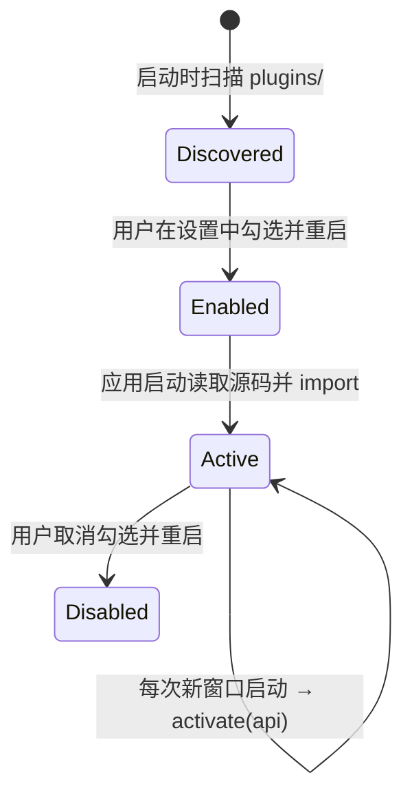

# 插件开发

MdNote 的可扩展性通过两层机制提供：

- **内置扩展**：随应用分发的 markdown-it 扩展（如 `==高亮==`），在设置中开关
- **外部插件**：放置在用户数据目录、由用户显式启用的独立插件

本文介绍扩展点、插件结构、API、完整示例与调试方法。

## 1. 扩展点总览

| 扩展点 | 能力 | 提供方式 |
| --- | --- | --- |
| markdown-it 插件 | 新增块 / 行内语法、改写渲染规则、注册新的 token 渲染器 | `api.addMarkdownItPlugin()` |
| 设置读取 | 读取当前全部用户设置 | `api.settings` |

> 插件有意被限制在 Markdown 语法扩展层。插件运行在沙箱渲染进程中，
> **没有 Node 能力、没有文件系统、没有原始 IPC**。

## 2. 插件文件结构

插件位于用户数据目录下的 `plugins/` 文件夹：

```
<userData>/plugins/
└── my-plugin/
    ├── package.json     # 声明 name 与 main
    └── index.js         # 插件入口（ESM，自包含单文件）
```

`package.json`：

```json
{
  "name": "my-plugin",
  "version": "1.0.0",
  "main": "index.js"
}
```

查看用户数据目录路径：设置面板插件区提示，或菜单「帮助 → 设置」。
Windows 下通常为 `%AppData%/md-note/`。

### 自包含要求

插件入口通过 Blob 以 ES 模块方式导入，**无法 `require('npm 包')`。
若要使用第三方 markdown-it 插件（如 markdown-it-container），
需用 esbuild / Rollup 将其与入口打包成单个文件：

```bash
npx esbuild src/index.js --bundle --format=esm --outfile=index.js
```

## 3. 生命周期



- 模块需 **`export default`** 一个含 `activate` 的对象
- `activate(api)` 在编辑器 Markdown 引擎构建时调用
- `deactivate()` 在应用退出 / 插件卸载时调用（用于清理）
- **启用 / 禁用需重启应用生效**（设置面板会主动提示）

## 4. PluginAPI 参考

```typescript
interface PluginAPI {
  /** 当前用户设置的只读快照（AppSettings 全部字段） */
  settings: AppSettings

  /**
   * 注册一个 markdown-it 插件
   * @param plugin markdown-it 插件函数 (md, ...params) => void
   * @param params 透传给插件的参数
   */
  addMarkdownItPlugin(
    plugin: (md: MarkdownIt, ...params: unknown[]) => void,
    ...params: unknown[]
  ): void
}
```

插件可用的 markdown-it 扩展能力（标准 markdown-it API）：

- `md.inline.ruler.push/before/after(name, fn)`：新增行内语法规则
- `md.block.ruler.push/before/after(name, fn)`：新增块级规则
- `md.renderer.rules[name]`：自定义 token 的 HTML 输出
- `md.core.ruler.push(name, fn)`：文档级处理
- 解析器辅助：`state.push()`、`md.utils.escapeHtml()` 等

## 5. 完整示例：表情短语法插件

`index.js`（自包含、ESM）：

```javascript
// 在行内识别 :smile: / :+1: / :rocket: 等短语法，输出对应 emoji
const EMOJI = {
  smile: '😄',
  '+1': '👍',
  rocket: '🚀',
  heart: '❤️',
  tada: '🎉'
}

function emojiRule(state, silent) {
  // 必须以 : 起始
  if (state.src.charCodeAt(state.pos) !== 0x3a /* : */) return false

  const end = state.src.indexOf(':', state.pos + 1)
  if (end === -1) return false

  const name = state.src.slice(state.pos + 1, end)
  if (!(name in EMOJI)) return false

  if (!silent) {
    const token = state.push('emoji_text', 'span', 0)
    token.content = EMOJI[name]
    token.markup = `:${name}:`
  }
  state.pos = end + 1
  return true
}

export default {
  activate(api) {
    api.addMarkdownItPlugin((md) => {
      // 在 escape 规则之后注册，避免影响转义序列
      md.inline.ruler.after('escape', 'short-emoji', emojiRule)
      md.renderer.rules.emoji_text = (tokens, idx) => tokens[idx].content
      console.log('[emoji-plugin] activated, user theme =', api.settings.theme)
    })
  },
  deactivate() {
    // 规则随引擎销毁自动失效；如有全局监听 / 定时器，在此清理
  }
}
```

打包（本例无第三方依赖，文件本身即可直接作为 index.js）。

## 6. 示例：使用 markdown-it-container（需打包）

`src/index.js`：

```javascript
import container from 'markdown-it-container'

export default {
  activate(api) {
    api.addMarkdownItPlugin(container, 'warning', {
      render(tokens, idx) {
        return tokens[idx].nesting === 1
          ? '<div class="warning-block"><strong>⚠ 注意</strong>'
          : '</div>'
      }
    })
  }
}
```

打包为自包含文件：

```bash
npm init -y && npm i markdown-it-container esbuild
npx esbuild src/index.js --bundle --format=esm --outfile=dist/index.js
```

之后文档中的：

```markdown
::: warning
这是一条警告
:::
```

将渲染为自定义警告块（输出仍受 CSP 约束；如需自定义视觉，
通过「帮助 → 打开自定义 CSS」添加 `.warning-block { … }`）。

## 7. 安全约束

插件产出的内容与其他 Markdown 内容一样经过 **DOMPurify 净化**：

- 无法输出脚本、内联事件、iframe / object
- 无法引入外部资源（受 CSP 限制）；自定义渲染只应产生安全 HTML
- 没有任何系统 API；不要尝试探测 `require`、`process`——它们不存在
- 插件中的事件监听 / 定时器应在 `deactivate()` 中清理

## 8. 调试

1. 按结构放好插件后，打开「设置」→ 插件区应列出插件名
   - 若未出现：检查 `package.json` 的 `name` / `main` 与 JSON 合法性
2. 勾选插件 → 应用 → 同意重启
3. 在 `activate` 中使用 `console.log`，主进程控制台（启动 dev 的终端）
   会转发渲染进程日志
4. 插件源码加载失败时终端会打印 `[PluginManager] failed to load <name>`
5. 开发插件时推荐使用 `npm run dev`（修改插件文件后在应用内
   `Ctrl+R` 等效重启即可重新读取）

## 9. 相关文档

- [架构设计](architecture.md)：PluginManager 的工作位置
- [安全模型](security.md)：插件的能力边界
- [数据模型](data-model.md)：规则与 token 如何进入块模型
