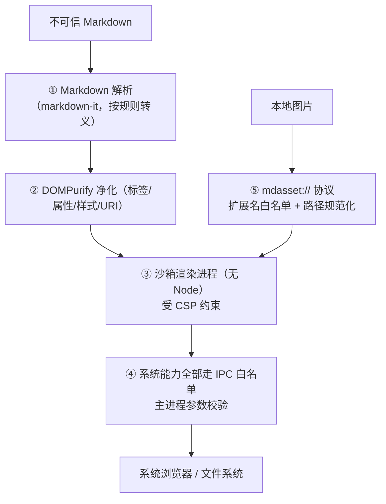

# 安全模型

本文描述 MdNote 的安全设计：威胁模型、纵深防护层次、内容净化管线、
协议与导航控制、CSP 策略，以及贡献者安全清单。

## 1. 威胁模型

MdNote 打开的 Markdown 文件是**不可信输入**——可能来自网络下载、他人分享，
其中可能包含：

- 内嵌 HTML / `<script>`
- 内联事件（`onerror=`、`onload=`）
- 危险 CSS（`expression()`、`@import`、外部 `url()`）
- `javascript:` / `data:` 伪链接
- 通过图片 / 链接语法探测本地文件（`../../etc/passwd`）
- Mermaid 恶意图表定义
- 诱导性外部链接、巨大文件（资源耗尽）

**核心原则：不信任任何文档内容；渲染能力与系统能力严格分离；
危险操作（打开外部程序 / 写文件）必须经过主进程白名单。**

## 2. 纵深防护



任何单层被绕过，其余层仍然成立（defense in depth）。

## 3. 进程隔离

窗口配置（`src/main/index.ts`）：

```typescript
webPreferences: {
  sandbox: true,              // 渲染进程运行在 OS 沙箱中
  contextIsolation: true,     // 页面与 Electron 内部上下文隔离
  nodeIntegration: false,     // 页面无法访问 Node
  webSecurity: true,          // 保持同源策略
  spellcheck: false
}
```

- 页面脚本（包括文档派生的 DOM）**没有任何 Node 能力**
- 页面只能访问 preload 经 `contextBridge` 暴露的 `window.mdnote`，
  接触不到 `ipcRenderer` 原始对象、无法伪造通道
- 单实例锁，避免多窗口重复持有监视器

## 4. IPC 最小面

- 通道清单**固定**（见 [架构设计 · IPC 契约](architecture.md#5-ipc-契约)），无动态通道
- 所有参数为普通可序列化数据；主进程在调用服务前：
  - 路径一律 `path.resolve` 规范化
  - 外部 URL 仅允许 `http(s)` / `mailto`
  - 插件源码读取限制在对应插件目录内（`startsWith(dir)`，防目录穿越）
  - 文本读取有 50MB 上限
- 渲染进程永远拿不到文件句柄、shell 句柄，只能表达「请对这个路径做这件白名单内的事」

## 5. 内容净化管线

所有 Markdown 渲染产物（含内嵌 HTML、Mermaid SVG）进入 DOM 前，
**必须**经过 `sanitizeHtml()` / `sanitizeSvg()`（DOMPurify 3）。

### 5.1 元素级规则（uponSanitizeElement）

| 元素 | 处理 |
| --- | --- |
| `<script>` | 移除（DOMPurify 默认） |
| `<object>` / `<embed>` / `<iframe>` / `<form>` | **移除** |
| `<input>` | 仅保留 `type="checkbox"`（任务列表），其余移除 |
| 允许的扩展标签 | `details / summary / abbr / mark / sub / sup / ins / del` |

### 5.2 属性级规则（uponSanitizeAttribute）

- **所有 `on*` 属性移除**（内联事件无法以任何大小写 / 变体保留）
| 属性 / 值 | 处理 |
| --- | --- |
| `style` 中含 `expression()` / `javascript:` / `vbscript:` / `@import` | 整条丢弃 |
| `style` 中外部 `url(...)` | 移除（SVG 局部 `url(#id)` 走专门的 SVG profile） |
| 清洗后为空的 style | 整个属性移除 |
| URI 属性 | 仅匹配白名单 scheme：`http(s) / mailto / tel / mdasset / data` 等 |

### 5.3 Mermaid

- `securityLevel: 'strict'`：图表中的 HTML 标签被转义、点击事件禁用
- Mermaid 产出的 SVG 再经 DOMPurify 的 SVG / SVG Filters profile 净化
- Mermaid 库本身动态加载，未开启 / 未使用时不加载

### 5.4 链接安全

- 外部链接渲染时自动加 `target="_blank" rel="noopener noreferrer"`
- 文档内链接点击由渲染进程接管；外部地址交系统浏览器（见下节）

## 6. 导航与新窗口控制

| 攻击面 | 控制 |
| --- | --- |
| `window.open` / `target="_blank"` | `setWindowOpenHandler` 一律 **deny**；若是 http(s) URL，转交系统浏览器，应用内不产生第二个渲染器 |
| 页面对自身做导航（`location.href=...`、链接直接点） | `will-navigate` 中阻止一切非我方页面的导航；文档链接走 JS 逻辑 |
| `shell.openExternal` | scheme 白名单（`http(s)` / `mailto`），拒绝 `file:` / 自定义协议被外部浏览器执行 |
| Markdown 相对链接指向其他 `.md` | 在应用内打开；其他本地文件才交系统 |

这保证文档里的任何内容都**无法把应用自身导航到攻击者页面**
（否则新页面将继承 `window.mdnote` 能力）。

## 7. 本地图片协议

Markdown 中的相对图片地址重写为 `mdasset://asset/?base=<文档目录>&src=<路径>`，
由主进程（`asset-protocol.ts`）处理：

- **扩展名白名单**：仅 png / jpg / jpeg / gif / webp / bmp / avif / ico / svg，其余 403
- 路径规范化，按文档目录解析相对路径
- 协议注册为 privileged（standard / secure），受同源与 CSP 约束

文档无法借图片语法读取非图片类型的任意本地文件。
远程图片仍是普通 http(s) URL，受 CSP 与浏览器跨域规则约束。

## 8. CSP（内容安全策略）

CSP 由主进程在响应头下发（`onHeadersReceived`），**不依赖文档本身**：

### 生产环境

```
default-src 'self';
script-src 'self';                 # 无 unsafe-eval，内联脚本不可执行
style-src 'self' 'unsafe-inline';  # KaTeX/主题需要内联样式
img-src 'self' data: blob: mdasset:;
font-src 'self' data:;
connect-src 'self' ws:;
worker-src 'self' blob:;
media-src 'self' mdasset:;
object-src 'none';                 # 无插件载体
base-uri 'none';                   # 禁止 <base> 篡改相对路径
```

### 开发环境

`script-src` 额外允许 `'unsafe-eval'`（Vite HMR / 依赖预构建需要），
其余策略与生产一致。安装包中不保留该放宽。

## 9. 插件安全

- 外部插件只能放在用户数据目录，且必须在设置中**显式勾选**才加载
- 插件运行在**沙箱渲染进程**中：没有 Node、没有原始 IPC，
  只能通过受控的 `PluginAPI` 注册 markdown-it 扩展
- 启用 / 禁用变更需重启生效，避免运行中热替换带来的攻击面
- 插件源码读取限定在该插件目录内

详见 [插件开发](plugin-development.md)。

## 10. 资源耗尽防护

| 场景 | 限制 |
| --- | --- |
| 读取文本文件 | 50 MB 上限 |
| 导出长图 | 宽 / 高上限 16,384px，防止异常位图分配 |
| 编辑历史 | 内存栈容量 300 条 |
| 渲染 / 高度缓存 | LRU 300 / Map 2000 裁剪 |
| Pandoc 子进程 | `windowsHide`，临时输入文件用后删除 |

## 11. 安全自查清单（贡献者）

- [ ] 任何文档派生 HTML 进入 DOM 前经过 `sanitizeHtml` / `sanitizeSvg`
- [ ] 不新增渲染进程的 Node 能力；不放开 sandbox / contextIsolation
- [ ] 新 IPC 通道：参数在主进程校验，默认拒绝未知值
- [ ] 外部 URL / 路径必须过白名单与规范化
- [ ] 不在渲染进程用 `window.open` / `location` 承载外部内容
- [ ] 新外部资源（字体 / 媒体 / fetch）先确认 CSP 是否需要调整，并说明理由
- [ ] 临时文件、离屏窗口、Blob URL 必须在 finally 中清理
- [ ] 面向外部的错误提示不泄露敏感绝对路径以外的系统信息

## 12. 相关文档

- [架构设计](architecture.md)：进程模型与 IPC 通道
- [插件开发](plugin-development.md)：插件能力边界
- [开发指南](development.md)：如何运行安全/冒烟检查
