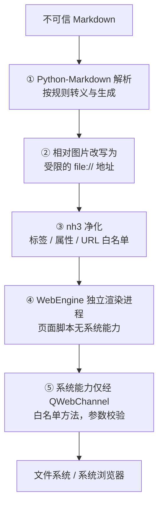

# 安全模型

本文描述 MdNote 的安全设计：威胁模型、纵深防护层次、进程隔离、
渲染内容净化、导航控制与桥接边界，以及贡献者安全清单。

## 1. 威胁模型

MdNote 打开的 Markdown 文件是**不可信输入**——可能来自网络下载或他人分享，
其中可能包含：

- 内嵌 HTML / `<script>`
- 内联事件（`onerror=`、`onload=`）
- `javascript:` 伪链接
- 诱导性外部链接
- 危险或追踪用的外部资源引用
- Mermaid 恶意图表定义
- 体积异常的内容（资源耗尽）

**核心原则：不信任任何文档内容；页面能力与系统能力严格分离；
需要系统能力的操作必须经过受控的桥接方法。**

## 2. 纵深防护

任何单层被绕过，其余层仍然成立（defense in depth）。

## 3. 进程隔离

- 排版页面运行在 **WebEngine 的独立进程**中，与应用主进程隔离
- 页面 JS 只负责编辑交互；**没有任何直接的文件系统、子进程能力**
- 应用主进程（Python）只运行我方代码，不执行文档来源的脚本
- 单实例守护，避免重复启动

页面与 Python 之间的唯一通道是 QWebChannel 暴露的 `Bridge` 对象，
页面无法访问通道底层、无法伪造额外通道。

## 4. 渲染内容净化（nh3）

所有 Markdown 渲染出的 HTML 在进入页面前都经过 `nh3.clean()`
（基于 Rust ammonia 的白名单净化，实现在 `editor/webview.py`）。

### 4.1 元素白名单

- 只保留排版所需标签（标题、段落、列表、表格、图片、代码、引用、常见行内标签等）
- `<script>`、`<object>`、`<embed>`、`<iframe>`、`<form>` 等被移除
- `<input>` 仅以白名单方式保留任务列表所需的复选框

### 4.2 属性与 URL 白名单

- 仅保留安全属性（`href`、`src`、`class`、`id`、`colspan` 等）
- **所有 `on*` 事件属性一律无法保留**
- URL 仅允许白名单协议：`http(s)`、`mailto`、`tel`、`file`、`data`
- 链接默认自动附加 `rel="noopener noreferrer"`
- `javascript:` 等危险链接的协议被剥离

> 即使脚本以某种方式插入 DOM，现代浏览器对 innerHTML 插入的
> `<script>` 也不会执行；而内联事件这一更现实的攻击面已被 nh3 移除。

### 4.3 图片地址处理

- 文档中的**相对图片地址**在渲染时改写为基于文档目录的绝对 `file://` URL，
  页面无法借图片语法以相对路径探测其他位置
- 远程图片仍是普通 `https?://` URL，受 WebEngine 的跨域与资源策略约束

### 4.4 Mermaid

- 初始化使用 `securityLevel: 'strict'`：图表中的 HTML 被转义、交互事件受限
- Mermaid 在页面端由图表文本生成，输入来自当前块，不经过外部来源

## 5. 导航控制

| 攻击面 | 控制 |
| --- | --- |
| 点击外部链接 | 页面脚本拦截，交**系统默认浏览器**打开；应用视图不跳转 |
| 页内锚点 / TOC | 在当前页面滚动，不产生导航 |
| 视图被引导到其他页面 | `navigationRequested` 中拒绝链接型导航，应用视图始终停留在本页面 |
| 外部 URL 打开 | `Bridge.openExternal` 仅放行 `http(s)` / `mailto` |

这样文档中的任何内容都无法把应用自身的排版视图导航到攻击者页面。

## 6. 桥接最小面

- 页面可调用的方法固定（见 [架构设计 · 桥接契约](architecture.md#5-python--页面-桥接契约)）
- 参数均为普通数据；Python 端在执行前做命令白名单与取值校验
- 写文件类操作（图片落盘）只写入当前文档对应的配置目录，文件名与路径受控制
- 页面永远拿不到文件 / 子进程句柄，只能表达「请对当前文档执行这件白名单内的事」

## 7. 资源耗尽防护

| 场景 | 策略 |
| --- | --- |
| 输入触发的派生计算 | 防抖，连续输入不逐字计算 |
| 撤销 / 重做栈 | 有上限的快照栈 |
| Pandoc 子进程 | 调用外部程序、超时受控 |
| 图片 / 媒体 | 懒加载 |

## 8. 安全自查清单（贡献者）

- [ ] 任何文档派生的 HTML 进入页面前经过 `_safe_html` 净化
- [ ] 不向页面暴露超出需要的系统能力；新方法默认拒绝未知参数
- [ ] 新的外部 URL / 协议先确认是否在白名单内，并说明理由
- [ ] 不让排版视图导航到应用页面以外的地址
- [ ] 写文件操作限定在受控目录，路径经过规范化
- [ ] 临时文件、工作线程在任务结束后清理

## 9. 相关文档

- [架构设计](architecture.md)：进程模型与桥接契约
- [数据模型](data-model.md)：块与渲染内容的来源
- [开发指南](development.md)：如何运行测试与构建
