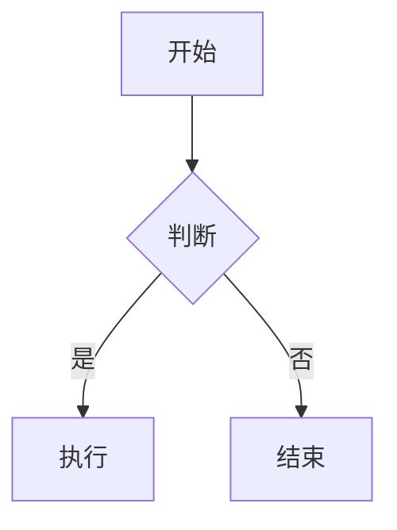

[toc]

# 一级标题

## 二级标题

### 三级标题

普通段落，包含 **加粗**、*斜体*、~~删除线==、`行内代码`、[外部链接](https://example.com) 以及行内公式 $E = mc^2$ 和货币示例 $5 价格。

> 这是一段引用。
> 第二行引用。

- 普通列表项 1
- 普通列表项 2
  - 嵌套项
- [ ] 未完成任务
- [x] 已完成任务

1. 有序列表一
2. 有序列表二

| 姓名 | 分数 | 备注 |
| :--- | :--: | ---: |
| 张三 | 95 | 优秀 |
| 李四 | 82 | 良好 |

```javascript
function hello(name) {
  console.log(`Hello, ${name}!`)
  return true
}
```



$$
\int_{0}^{\infty} e^{-x^2}\,dx = \frac{\sqrt{\pi}}{2}
$$

---

段落位于分隔线之后。
